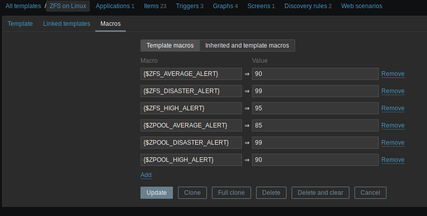

# Monitor ZFS on Linux on Zabbix

This template is a modified version of the original work done by pbergdolt and posted on the zabbix forum a while ago here: https://www.zabbix.com/forum/zabbix-cookbook/35336-zabbix-zfs-discovery-monitoring?t=43347 .

I have maintained and modified this template over the years and the different versions of ZoL on a large number of servers so I'm pretty confident that it works ;)

Tested Zabbix server version include 3.0, 3.4 and 4.0. The template shipped here is in 3.0 format to allow import to all those versions.

This template will give you graph on basically everything, with included triggers for low disk space and other alarms. Disk space alarms can be customized using Zabbix macros.

Example of graph:
- Arc memory usage and hit rate:

- Complete breakdown of META and DATA usage:

- Dataset usage, with available space, and breakdown of used space with directly used space, space used by snapshots and space used by children:


# Supported OS and ZoL version
Any Linux variant should work, tested version by myself include:
- Debian 8 and 9
- Ubuntu 16.04 and 18.04
- CentOS 6 and 7

About the ZoL version, this template is intended to be used by ZoL version 0.7.0 or superior but still works on the 0.6.x branch.

# Installation on Zabbix server

To use this template, follow those steps:

## Create the needed regular expressions on the Zabbix server
On your zabbix server web UI, go to:
- Administration
- General
- Regular expressions

Then Create 2 new regular expressions:
- "ZFS fileset"

Expression type: `Character string included`

Expression: `/`


- "not docker ZFS dataset"

Expression type: `Result is FALSE`

Expression: `([a-z-0-9]{64}$|[a-z-0-9]{64}-init$)`


The second expression is to avoid this template to discover docker ZFS datasets because there can be *a lot* of them and they are not that useful to monitor as long as you monitor the parent dataset. This is especially true on host that create and destroy a lot of docker containers all day, creating dataset that disapear shortly after creation.
## Create the Value mapping "ZFS zpool scrub status"
Go to:
- Administration
- General
- Value mapping

Then create a new value map named `ZFS zpool scrub status` with the following mappings:
| Value | Mapped to |
| ----- | --------- |
| 0 | Scrub in progress |
| 1 | No scrub in progress |


# Installation on the server you want to monitor
## Prerequisites
The server needs to have some very basic tools to run the user parameters:
- awk
- cat
- grep
- sed
- tail

Usually, they are already installed and you don't have to install them.
## Add the userparameters file on the servers you want to monitor

There are 2 different userparameters files in the "userparameters" directory of this repository.

One uses sudo to run and thus you must give zabbix the correct rights and the other doesn't use sudo.

On recent ZFS on Linux versions (eg version 0.7.0+), you don't need sudo to run `zpool list` or `zfs list` so just install the file `ZoL_without_sudo.conf` and you are done.

For older ZFS on Linux versions (eg version 0.6.x), you will need to add some sudo rights. On some distribution, ZoL already includes a file with all the necessary rights at `/etc/sudoers.d/zfs` but its content is commented, just remove the comments and any user will be able to list zfs datasets and pools. For convenience, here is the content of the file commented out:
```
## Allow read-only ZoL commands to be called through sudo
## without a password. Remove the first '#' column to enable.
##
## CAUTION: Any syntax error introduced here will break sudo.
##
## Cmnd alias specification
Cmnd_Alias C_ZFS = \
  /sbin/zfs "", /sbin/zfs help *, \
  /sbin/zfs get, /sbin/zfs get *, \
  /sbin/zfs list, /sbin/zfs list *, \
  /sbin/zpool "", /sbin/zpool help *, \
  /sbin/zpool iostat, /sbin/zpool iostat *, \
  /sbin/zpool list, /sbin/zpool list *, \
  /sbin/zpool status, /sbin/zpool status *, \
  /sbin/zpool upgrade, /sbin/zpool upgrade -v

## allow any user to use basic read-only ZFS commands
ALL ALL = (root) NOPASSWD: C_ZFS
```
If you don't know where your "userparameters" directory is, this is usually the `/etc/zabbix/zabbix_agentd.d` folder. If in doubt, just look at your `zabbix_agentd.conf` file for the line begining by `Include=`, it will show where it is.

## Restart zabbix agent
When you have added the template to you zabbix agent, restart it so that it will load the new userparameters.

# Customization of alert level by server
This template includes macros to define when the triggers will fire.

By default, you will find them on the macro page of this template:


If you change them here, they will apply to every hosts linked to this template, which may not be such a good idea. Prefer to change the macros on specific servers if needed.

You can see how the macros are used by looking at the discovery rules, then "Trigger prototypes":


